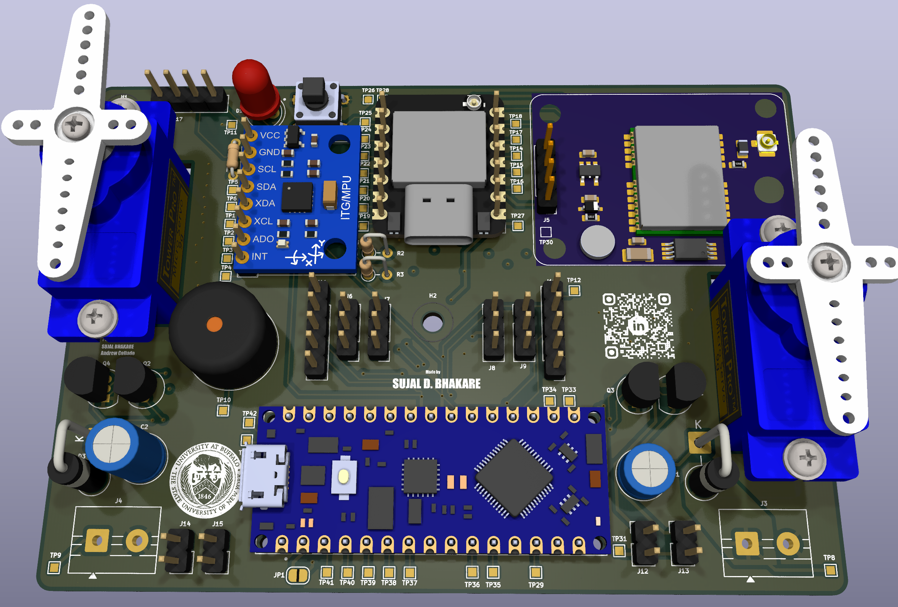
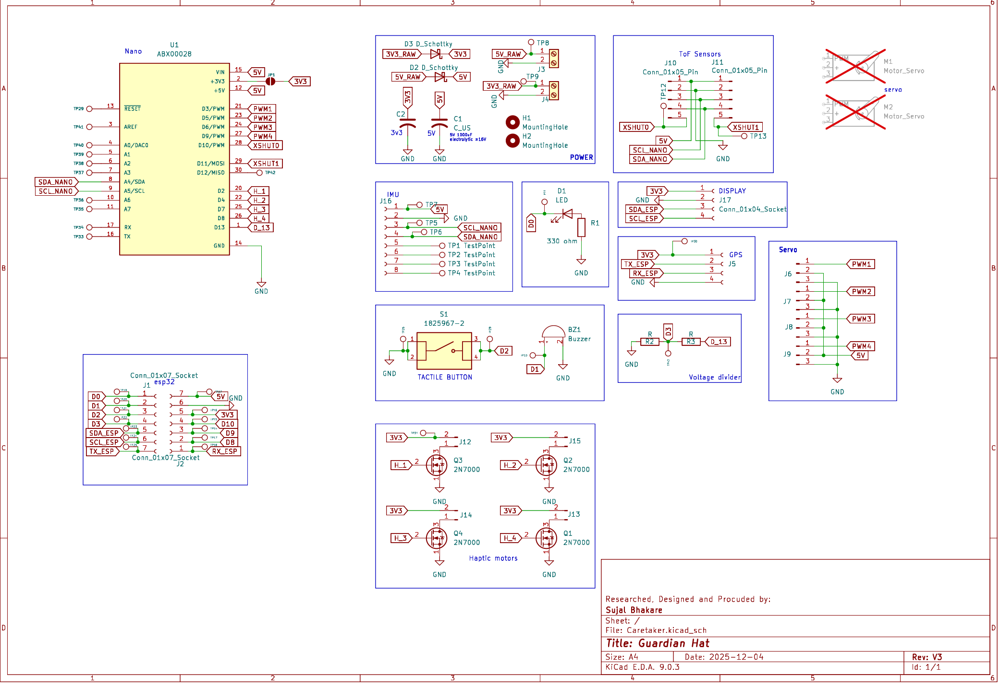

<div id="top">

<!-- HEADER STYLE: CLASSIC -->
<div align="center">


# GuardianHAT

<em>Real-Time Embedded System for GPS Tracking and Environmental Monitoring</em>

<!-- BADGES -->


<em>Built with the tools and technologies:</em>

**C/C++ • ESP32-CAM • Arduino Nano • FreeRTOS • PlatformIO • KiCad PCB Design**

</div>
<br>

---

## Table of Contents

- [Overview](#overview)
- [Features](#features)
- [Hardware Components](#hardware-components)
- [PCB Design](#pcb-design)
  - [PCB Images](#pcb-images)
  - [Design Process](#design-process)
  - [Bill of Materials](#bill-of-materials)
- [Project Structure](#project-structure)
- [Getting Started](#getting-started)
  - [Prerequisites](#prerequisites)
  - [Installation](#installation)
  - [Usage](#usage)
  - [Testing](#testing)
- [System Architecture](#system-architecture)
- [Roadmap](#roadmap)
- [Contributing](#contributing)
- [License](#license)
- [Author](#author)
- [Acknowledgments](#acknowledgments)

---

## Overview

GuardianHAT is a comprehensive embedded systems solution that integrates GPS tracking, environmental sensing, and real-time monitoring capabilities. The project features two main components: an ESP32-CAM based system for camera functionality and location tracking, and an Arduino Nano RTOS implementation for sensor data processing with FreeRTOS task management.

The system includes a custom-designed PCB (Caretaker Board) that integrates all components for a professional, production-ready embedded solution.

**Key Highlights:**
- Real-time GPS satellite tracking and location monitoring
- Environmental sensing with MPU6050 (accelerometer/gyroscope)
- Distance measurement using VL53L0X ToF sensor
- OLED display (SSD1306) for real-time data visualization
- Custom PCB design with professional manufacturing files
- Multi-threaded RTOS implementation for concurrent task execution

---

## Features

### Core Functionality
- **GPS Tracking**: Real-time satellite position tracking with TinyGPS++ library
- **Motion Detection**: 6-axis motion sensing using MPU6050 (accelerometer + gyroscope)
- **Distance Measurement**: Precise ranging with VL53L0X Time-of-Flight sensor
- **Visual Display**: 128x64 OLED display for live sensor data and status information
- **Camera Module**: ESP32-CAM integration for image capture and processing
- **Real-Time OS**: FreeRTOS implementation for efficient task scheduling and resource management

### Technical Features
- Multi-tasking architecture with independent sensor polling tasks
- I2C and SPI communication protocols
- Low-power design optimizations
- Interrupt-driven button and buzzer control
- Hardware abstraction for easy sensor integration
- Professional PCB with proper power regulation and signal integrity

---

## Hardware Components

| Component | Model | Interface | Purpose |
|-----------|-------|-----------|---------|
| **Microcontroller** | ESP32-S3 (CAM) | - | Main processing unit with WiFi/BT |
| **Microcontroller** | Arduino Nano Every | - | RTOS sensor controller |
| **GPS Module** | NEO-6M | UART | Location tracking |
| **IMU Sensor** | MPU6050 | I2C | Motion and orientation |
| **Distance Sensor** | VL53L0X | I2C | Time-of-Flight ranging |
| **Display** | SSD1306 OLED | I2C | 128x64 visual feedback |
| **Camera** | OV2640 | - | Image capture |
| **Feedback** | Buzzer, LED| GPIO| User feedback|
| **Actuators** | Servos | PWM | Control |

---

## PCB Design

### PCB Images

The custom Caretaker PCB was designed in KiCad to integrate all system components on a single board.

<div style="display:flex;align-items:center;justify-content:space-between;" > 


</div>
<div style="display:flex;align-items:center;justify-content:space-between;" > 


</div>


### Design Process

**Tools Used:**
- **KiCad 6.0+**: Schematic capture and PCB layout
- **Component Libraries**: Custom footprints for Adafruit modules and sensors

**Manufacturing Files** (Generated Gerbers):
- `Caretaker-F_Cu.gbr` - Front copper layer
- `Caretaker-B_Cu.gbr` - Back copper layer
- `Caretaker-F_Mask.gbr` - Front soldermask
- `Caretaker-B_Mask.gbr` - Back soldermask
- `Caretaker-F_Paste.gbr` - Front paste layer (for stencil)
- `Caretaker-B_Paste.gbr` - Back paste layer
- `Caretaker-F_Silkscreen.gbr` - Front silkscreen
- `Caretaker-B_Silkscreen.gbr` - Back silkscreen
- `Caretaker-Edge_Cuts.gbr` - Board outline
- `Caretaker-job.gbrjob` - Gerber job file

**PCB Specifications:**
- **Layers**: 2-layer PCB
- **Dimensions**: 99mm x 70mm
- **Thickness**: 1.6mm (standard)
- **Copper Weight**: 1 oz (35 μm)
- **Surface Finish**: HASL

**Design Considerations:**
- Proper power plane separation for analog/digital circuits
- I2C pull-up resistors on SDA/SCL lines
- Decoupling capacitors near power pins
- Ground plane for noise reduction
- Clear component labeling on silkscreen

### Bill of Materials

Complete the quantities and part numbers based on your actual design:

| Qty | Value | Package | Description | Manufacturer Part # | Notes |
|-----|-------|---------|-------------|---------------------|-------|
| 1  | ESP32-S3 | Module | Main MCU with WiFi/BT | ESP32-S3-WROOM-1 | Seeed XIAO ESP32S3 |
| 1  | Arduino Nano | Module | RTOS Controller | ABX00028 | Arduino Nano Every |
| 1  | NEO-6M | Module | GPS Module | NEO-6M | U-blox GPS |
| 1  | MPU6050 | Module | 6-axis IMU | GY-521 | Accelerometer + Gyro |
| 1  | VL53L0X | Module | ToF Distance Sensor | - | Adafruit breakout |
| 1  | SSD1306 | Module | OLED Display | - | 128x64 I2C display |
| 1  | OV2640 | Module | Camera Module | - | ESP32-CAM compatible |
| 4  | Servo | SG90 | Micro Servo 9g | SG90 | Tower Pro |
| 1  | Buzzer | THT | Active/Passive Buzzer | - | 5V buzzer |
| 2 | LED | THT | Status Indicators | - | Red/Green |
| 2 | Resistor 4.7kΩ | THT | I2C Pull-up Resistors | - | 1% tolerance |
| 4 | Resistor 330Ω | THT | LED Current Limiting | - | - |
| 1 | Push Button | THT | User Input | 1825967-2 | Tactile switch |
| 4 | Capacitor 0.1µF | THT | Decoupling Capacitors | - | Ceramic, X7R |
| 2 | Capacitor 470µF | THT | Bulk Capacitors | - | Ceramic, X7R |
| 1 | Header | 2.54mm | UART/Debug | - | 4-pin header |
| 3 | Header | 2.54mm | I2C Expansion | - | 4-pin headers |


**Total Estimated Cost**: $50.00

**Suggested Suppliers:**
- DigiKey
- Mouser Electronics  
- Adafruit
- SparkFun
- Amazon (for modules)
- JLCPCB (for pcb fabrication)

---

## Project Structure

```sh
└── GuardianHAT/
    ├── ESP32_CAM/                    # ESP32-CAM module firmware
    │   ├── platformio.ini            # PlatformIO configuration
    │   ├── src/
    │   │   └── main.cpp              # Main ESP32 application
    │   ├── testing_code/             # Individual component tests
    │   │   ├── GPS.cpp               # GPS module testing
    │   │   ├── display.cpp           # OLED display testing
    │   │   └── buzzer_button_led.cpp # I/O peripheral tests
    │   └── lib/                      # External libraries
    │
    ├── NANO_RTOS/                    # Arduino Nano with FreeRTOS
    │   ├── platformio.ini            # PlatformIO configuration
    │   ├── src/
    │   │   └── main.cpp              # FreeRTOS task implementation
    │   └── lib/                      # RTOS and sensor libraries
    │
    ├── PCB_Design/                   # KiCad PCB project
    │   ├── Caretaker.kicad_pro       # KiCad project file
    │   ├── Caretaker.kicad_sch       # Schematic file
    │   ├── Caretaker.kicad_pcb       # PCB layout file
    │   ├── Library/                  # Custom component libraries
    │   │   ├── symbols/              # Custom schematic symbols
    │   │   └── footprints/           # Custom PCB footprints
    │   ├── Production/               # Manufacturing files (Gerbers)
    │      └── *.gbr                 # Gerber files for fab house
    │
    ├── LICENSE                       # Project license
    └── README.md                     # This file
```

---

## Getting Started

### Prerequisites

**Software Requirements:**
- **PlatformIO**: IDE extension for VS Code or CLI
- **Python 3.7+**: For PlatformIO installation
- **Git**: For version control
- **KiCad 7.0+**: For PCB design viewing/editing (optional)

**Hardware Requirements:**
- ESP32-S3 development board (Seeed XIAO ESP32S3 or similar)
- Arduino Nano Every
- USB-C cable for ESP32
- Micro-USB cable for Arduino Nano
- All sensors and components from BOM

### Installation

1. **Clone the repository:**

```sh
git clone https://github.com/sujaldeshmukh1012/GuardianHAT.git
cd GuardianHAT
```

2. **Install PlatformIO:**

```sh
# Install PlatformIO Core (CLI)
pip install platformio

# Or install VS Code + PlatformIO IDE extension
code --install-extension platformio.platformio-ide
```

3. **Install project dependencies:**

PlatformIO will automatically install dependencies defined in `platformio.ini` when you build the project.

```sh
# For ESP32-CAM module
cd ESP32_CAM
pio lib install

# For NANO RTOS module
cd ../NANO_RTOS
pio lib install
```

### Usage

**Build and Upload ESP32-CAM Firmware:**

```sh
cd ESP32_CAM
pio run --target upload
pio device monitor  # View serial output
```

**Build and Upload Arduino Nano Firmware:**

```sh
cd NANO_RTOS
pio run --target upload
pio device monitor  # View serial output
```

**Serial Monitor Settings:**
- Baud Rate: 115200
- Line Ending: Newline

**Expected Output:**
```
[GPS] Satellites: 8, Location: 42.9634° N, 78.7384° W
[MPU6050] Accel: X=0.02g Y=0.98g Z=0.05g
[VL53L0X] Distance: 245mm
[Display] Status: OK
```

### Testing

The project includes individual component test files in `ESP32_CAM/testing_code/`:

**Test GPS Module:**
```sh
# Edit platformio.ini to set src_dir to testing_code
# Then uncomment the GPS.cpp file
pio run --target upload
```

**Test Display:**
```sh
# Use display.cpp as main source
pio run --target upload
```

**Test I/O Peripherals:**
```sh
# Use buzzer_button_led.cpp as main source
pio run --target upload
```

**Run All Tests:**
```sh
# Both projects include test directories
cd NANO_RTOS
pio test

cd ../ESP32_CAM
pio test
```

---

## System Architecture

### ESP32-CAM Module
- **Main Tasks**: Camera capture, WiFi connectivity, GPS data logging
- **Sensors**: GPS (NEO-6M), Camera (OV2640)
- **Communication**: WiFi for data transmission

### Arduino Nano RTOS Module
- **Main Tasks**: Sensor polling, OLED display updates, real-time processing
- **RTOS Tasks**:
  - Task 1: MPU6050 data acquisition (100Hz)
  - Task 2: VL53L0X distance measurement (50Hz)
  - Task 3: Display update task (10Hz)
  - Task 4: User input handling (interrupt-based)
- **Communication**: I2C for sensors, SPI for potential expansions

### Communication Protocol
The two modules communicate via UART to share sensor data and coordinate actions.

---

## Author

<div align="center">


### Sujal Bhakare

**Systems Engineer | Computer Science Student**

[](https://www.linkedin.com/in/sujal-bhakare/)
[](https://github.com/sujaldeshmukh1012)
[](mailto:sujaldat@buffalo.edu)
[](https://sujalbhakare.com)

</div>
---


## Acknowledgments

- **Adafruit Industries**: For excellent sensor libraries and breakout boards
- **Arduino Community**: For FreeRTOS port and examples
- **Espressif Systems**: For ESP32 development framework
- **KiCad EDA**: For open-source PCB design software
- **TinyGPS++**: Mikal Hart's GPS parsing library
- **Course Staff**: CSE321 instructor and TAs
- **My Amazing Teammate:** Andrew Collado [LinkedIn](https://www.linkedin.com/in/andrew-collado/)

### References
- [ESP32-CAM Documentation](https://docs.espressif.com/)
- [FreeRTOS Documentation](https://www.freertos.org/Documentation/RTOS_book.html)
- [KiCad Documentation](https://docs.kicad.org/)
- [PlatformIO Documentation](https://docs.platformio.org/)

---

<div align="center">

**[⬆ Back to Top](#top)**

Made with ❤️ by [Andrew Collado]((https://www.linkedin.com/in/andrew-collado/)) & [Sujal Bhakare](https://sujalbhakare.com)

</div>
